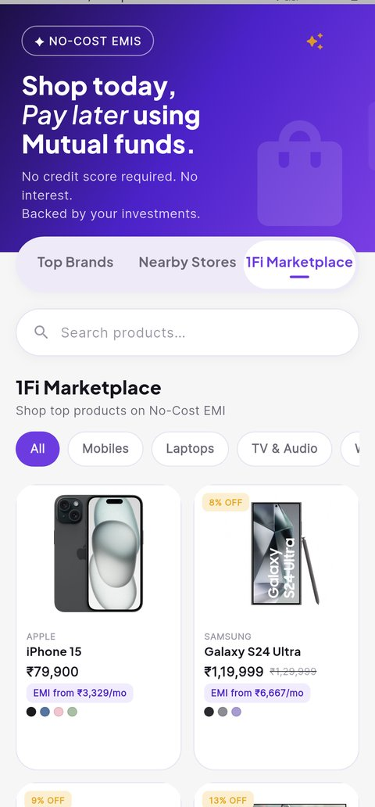
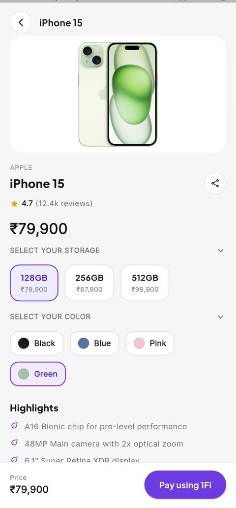

# 1Fi Marketplace

A **1Fi Marketplace** section built into the Shop page of a Flutter app styled after the real 1Fi app — submitted for the 1Fi SDE Intern Assignment.

**It's live, not a local demo.** `flutter run` on any device or platform talks straight to a deployed API (`https://app-submission-marketplace.vercel.app/api/products`, Vercel → Neon Postgres) — no local server, no `.env` file, no setup step between cloning this repo and seeing real data on screen.

<p align="center">
  
  &nbsp;&nbsp;
  
  &nbsp;&nbsp;
  
</p>

## What's here

- **`1fi_flutter/`** — the Flutter app. Shop page with three tabs (`Top Brands`, `Nearby Stores` — intentionally blank per the assignment brief, and `1Fi Marketplace` — fully built).
- **`api/products.js`** — the Vercel serverless function that actually serves the app, using Neon's HTTP driver.
- **`server.js`** — the original Express version of the same route, kept for local backend iteration.
- **`db/`** — `schema.sql` and `seed.sql` for the `products` table.
- **`shop-page.html`** — an earlier static-HTML prototype, kept for reference; the Flutter app is the deliverable.

## Assignment checklist

| Requirement | Where |
|---|---|
| Product listing, search, category filter | `screens/shop_page.dart` |
| Product image | `widgets/product_image.dart` — resolves network photo → bundled asset → icon, in that order |
| Product name, pricing, variants | `models/product.dart`, `widgets/variant_selectors.dart` |
| EMI options/plans, plan selection | `screens/pay_screen.dart` |
| Relevant product details | `highlights` field, rendered on the detail screen |
| CTA to proceed with selected plan | "Proceed to pay" → `widgets/confirm_sheet.dart` |
| Data retrieved dynamically, not hardcoded | Real Postgres (Neon) behind a real API (Vercel) — not a mock |
| Responsive, smooth UX | Tested live on physical Android hardware throughout |
| Loading and error states | `AppState.status` (loading/ready/error) with retry |
| Consistent with existing 1Fi app | Hero banner copy, tab bar spacing/overlap, and page background were redlined pixel-for-pixel against real app screenshots |

## Beyond the brief

A few things that weren't required but seemed worth doing properly:

- **Per-variant product photos.** Selecting a color (or a TV's screen size) swaps in that exact option's photo, sourced live from the retailer's own CDN — not one static image per product.
- **Tap to zoom.** The product photo opens fullscreen with pinch-to-zoom (`widgets/fullscreen_image_viewer.dart`).
- **Real sharing.** The share button downloads whatever photo is currently on screen and attaches it to the OS share sheet — not just a text link.
- **Instant repeat launches.** The catalog response is cached to disk (`shared_preferences`) and painted immediately on next launch, refreshing over the network in the background — a transient network blip doesn't blank the screen if there's a cached catalog to show instead.

## Notable engineering decisions

**Two backends, on purpose.** `api/products.js` (what the app actually talks to) uses `@neondatabase/serverless`'s HTTP driver instead of a connection pool. A Vercel function is a new short-lived process per invocation — a `pg.Pool` built for a long-running server would open a fresh connection on every cold start and exhaust Neon's connection limit under real traffic. `server.js` (Express + `pg.Pool`) is the right tool for local iteration, kept around for exactly that.

**A real bug, caught before it mattered.** Flutter's default project template puts the `INTERNET` permission only in `android/app/src/debug/AndroidManifest.xml` — enough for every debug run to work invisibly, but a release build had *zero* network permission. Every request failed at the OS level with a DNS lookup error, even though the same URL worked fine in the phone's own browser seconds earlier — which is what made it non-obvious. Caught by comparing a release APK against the debug build before considering this "done," not by luck.

**Stale-while-revalidate over a spinner.** `AppState.loadProducts()` shows cached data instantly, then refreshes silently — a design choice made after noticing that reopening the Marketplace tab shouldn't feel like the first load every time.

## Running it

```bash
cd 1fi_flutter
flutter pub get
flutter run
```

That's it. `ApiService.baseUrl` defaults to the deployed API.

### Running the backend locally (only needed if you're changing it)

```bash
npm install
cp .env.example .env   # fill in DATABASE_URL with your Neon connection string
npm start               # http://localhost:4000
psql "$DATABASE_URL" -f db/schema.sql
psql "$DATABASE_URL" -f db/seed.sql
```

Then point the app at it instead of Vercel:

```bash
flutter run --dart-define=API_BASE_URL=http://10.0.2.2:4000        # Android emulator
flutter run --dart-define=API_BASE_URL=http://localhost:4000       # iOS simulator / macOS / web
```

**Physical device**, USB (Android): `adb reverse tcp:4000 tcp:4000`, then use `http://localhost:4000`. Over Wi-Fi on either platform: use your computer's LAN IP (`ipconfig getifaddr en0` on macOS) instead of `localhost`, since a phone is on its own network stack and can't reach either alias.

## Known trade-offs

Made deliberately, not oversights — flagging them rather than hoping they go unnoticed:

- **iOS and web are untested against the final build.** Development and all verification happened on a physical Android device; the code is standard cross-platform Flutter with no Android-specific APIs, but "should work" isn't the same as "verified."
- **No automated tests.** Given the time available, effort went into shipping and verifying real functionality on real hardware over writing tests for it.
- **The catalog has 6 products.** Started at 8; two were removed while iterating on the data model.
- **The bottom navigation bar and a dark-mode toggle were built, then removed** to keep the Shop page focused on what the assignment actually asks for. Both exist in git history if useful.
